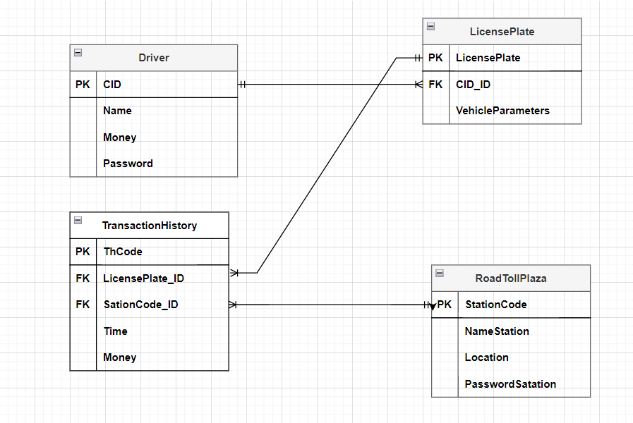

## Dự án sử dụng các ứng dụng của AI trong trạm thu phí BOT triển khai trên nền tảng web bằng các framework chính là FastAPI và ReactJs.
Thực hiện bởi các sinh viên: Nguyễn Tuấn Thành, Nguyễn Công Thành, Vũ Đình Thọ.

### Các chức năng của tài xế:
- Đăng nhập.
- Đăng kí tài khoản tài xế.
- Kiểm tra tài khoản còn bao nhiêu tiền.
- Tra lịch sử giao dịch.
- Thông tin xe.
- Thêm xe.
- Sửa xóa 1 số thông tin.

### Các chức năng của nhân viên quản lí trạm:
- Đăng nhâp.
- Đăng kí tài khoản cho cây.
- Kiểm tra lịch sử giao dịch của cây.
- Hiển thị các webcam.

### Về cơ sở dữ liệu tôi sử dụng lược đồ như sau:

## User Stories:
- Là người dùng, tôi muốn có thể tạo tài khoản mới bằng số điện thoại và mật khẩu để sử dụng ứng dụng BOT.
- Là người dùng, tôi muốn có thể đăng nhập vào tài khoản bằng số điện thoại và mật khẩu đã tạo.
- Là người dùng, tôi muốn có thể nạp tiền vào tài khoản bằng nhiều phương thức thanh toán khác nhau như thẻ ngân hàng, ví điện tử, v.v.
- Là người dùng, tôi muốn có thể liên kết biển số xe của mình với tài khoản BOT.
- Là người dùng, tôi muốn có thể kích hoạt tính năng tự động thanh toán phí BOT cho phương tiện của mình.
- Là người dùng, tôi muốn có thể theo dõi lịch sử thanh toán phí BOT của mình.
- Là người dùng, tôi muốn có thể liên hệ với bộ phận hỗ trợ khách hàng nếu gặp bất kỳ vấn đề nào.

